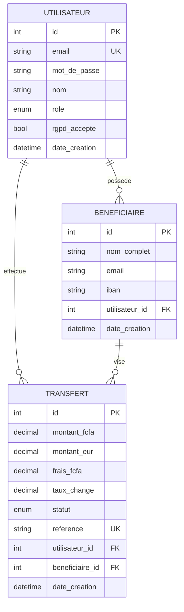

# NORU — Modèle de données (MCD / MLD)

> Phase 2 — Conception. Décrit la structure des données : entités, attributs, relations, types et contraintes.

---

## 1. MCD — Modèle Conceptuel de Données

Le MCD décrit les entités métier et leurs associations, sans préoccupation technique.

### Entités relationnelles (MySQL)

- **Utilisateur** : `id`, `email`, `mot_de_passe`, `nom`, `role`, `rgpd_accepte`, `date_creation`
- **Beneficiaire** : `id`, `nom_complet`, `email`, `iban`, `date_creation`
- **Transfert** : `id`, `montant_fcfa`, `montant_eur`, `frais_fcfa`, `taux_change`, `statut`, `reference`, `date_creation`

### Associations et cardinalités

| Association | Cardinalités | Lecture |
|---|---|---|
| Utilisateur **possède** Beneficiaire | (0,n) — (1,1) | un utilisateur a 0..n bénéficiaires ; un bénéficiaire appartient à 1 utilisateur |
| Utilisateur **effectue** Transfert | (0,n) — (1,1) | un utilisateur fait 0..n transferts ; un transfert a 1 envoyeur |
| Beneficiaire **vise** Transfert | (0,n) — (1,1) | un bénéficiaire reçoit 0..n transferts ; un transfert vise 1 bénéficiaire |

### Entité NoSQL (MongoDB)

- **Notification** : `_id`, `type`, `destinataire`, `sujet`, `contenu`, `transfert_id` (référence simple), `statut_envoi`, `date_envoi`

> Justification NoSQL : les notifications sont nombreuses, à format souple et non relationnelles → MongoDB. Lien vers le transfert par simple référence, pas par clé étrangère.

### Diagramme entité-association (Mermaid)



---

## 2. MLD — Modèle Logique de Données

### Table `utilisateur`
| Colonne | Type SQL | Contraintes |
|---|---|---|
| id | INT | PK, AUTO_INCREMENT |
| email | VARCHAR(180) | NOT NULL, UNIQUE |
| mot_de_passe | VARCHAR(255) | NOT NULL (hash bcrypt) |
| nom | VARCHAR(100) | NOT NULL |
| role | ENUM('USER','ADMIN') | NOT NULL, défaut 'USER' |
| rgpd_accepte | BOOLEAN | NOT NULL, défaut false |
| date_creation | DATETIME | NOT NULL, défaut now() |

### Table `beneficiaire`
| Colonne | Type SQL | Contraintes |
|---|---|---|
| id | INT | PK, AUTO_INCREMENT |
| nom_complet | VARCHAR(150) | NOT NULL |
| email | VARCHAR(180) | NOT NULL |
| iban | VARCHAR(34) | NOT NULL |
| utilisateur_id | INT | FK → utilisateur(id), NOT NULL, ON DELETE CASCADE |
| date_creation | DATETIME | défaut now() |

### Table `transfert`
| Colonne | Type SQL | Contraintes |
|---|---|---|
| id | INT | PK, AUTO_INCREMENT |
| montant_fcfa | DECIMAL(12,2) | NOT NULL, CHECK (montant_fcfa > 0) |
| montant_eur | DECIMAL(12,2) | NOT NULL |
| frais_fcfa | DECIMAL(12,2) | NOT NULL, défaut 0 |
| taux_change | DECIMAL(10,6) | NOT NULL |
| statut | ENUM('EN_ATTENTE','PAYE','ENVOYE','RECU','ECHEC') | NOT NULL, défaut 'EN_ATTENTE' |
| reference | VARCHAR(30) | NOT NULL, UNIQUE |
| utilisateur_id | INT | FK → utilisateur(id), NOT NULL |
| beneficiaire_id | INT | FK → beneficiaire(id), NOT NULL |
| date_creation | DATETIME | défaut now() |

### Collection MongoDB `notifications`
```json
{
  "_id": "ObjectId",
  "type": "EMAIL",
  "destinataire": "awa@example.com",
  "sujet": "Vous avez reçu un transfert NORU",
  "contenu": "Bonjour, un transfert de 152,45 € vous a été envoyé...",
  "transfert_id": 42,
  "statut_envoi": "ENVOYE",
  "date_envoi": "2026-06-16T10:00:00Z"
}
```

---

## 3. Justification des choix (réponses jury)

- **DECIMAL et non FLOAT** pour les montants : précision exacte, pas d'arrondi flottant sur de l'argent.
- **ENUM** pour `role` et `statut` : contraint les valeurs valides au niveau base de données.
- **taux_change stocké dans le transfert** : traçabilité (le taux varie dans le temps, on conserve celui appliqué).
- **UNIQUE sur email et reference** : empêche les doublons (un email = un compte, une référence = un transfert).
- **ON DELETE CASCADE** sur les bénéficiaires : si un utilisateur supprime son compte (RGPD), ses bénéficiaires sont supprimés avec lui.
- **Notification en MongoDB** : données de log volumineuses et non relationnelles → meilleur choix que le relationnel.
