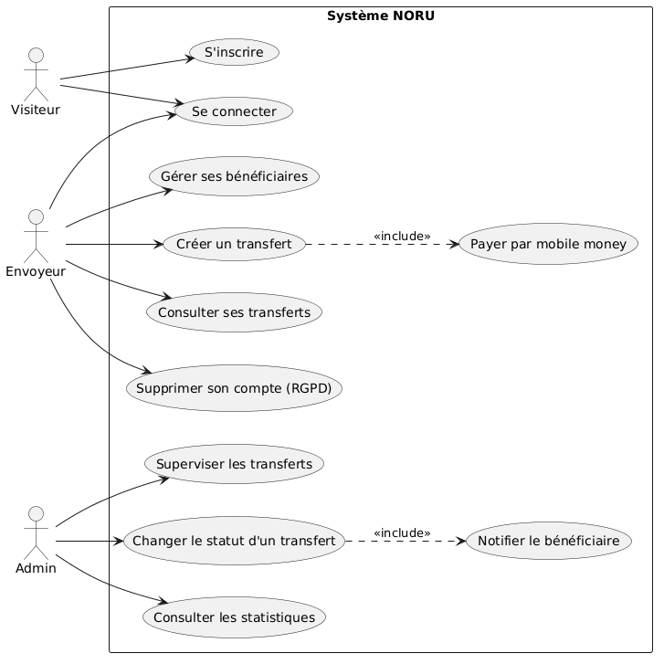
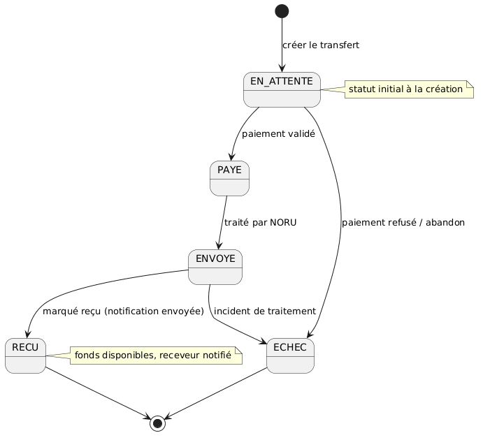
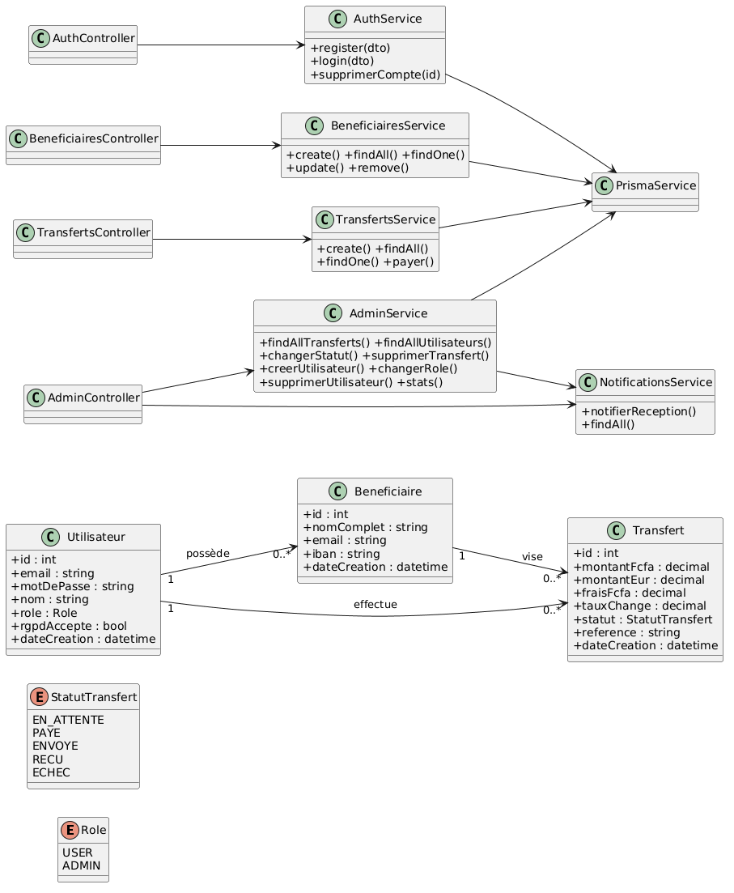
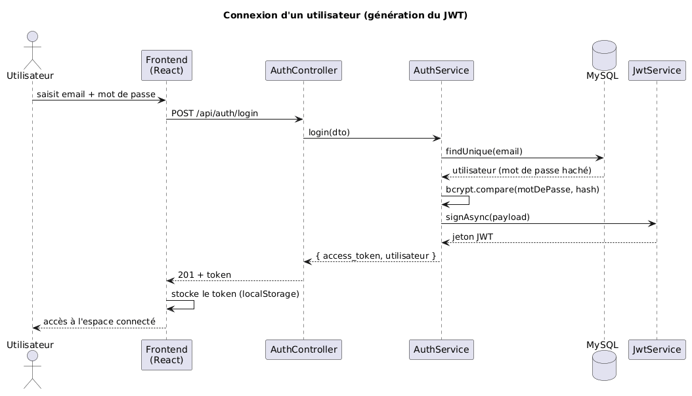
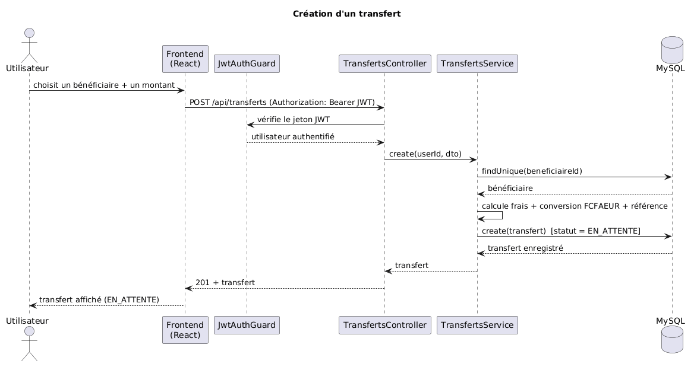
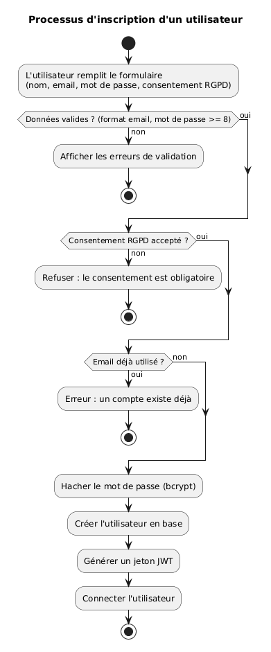
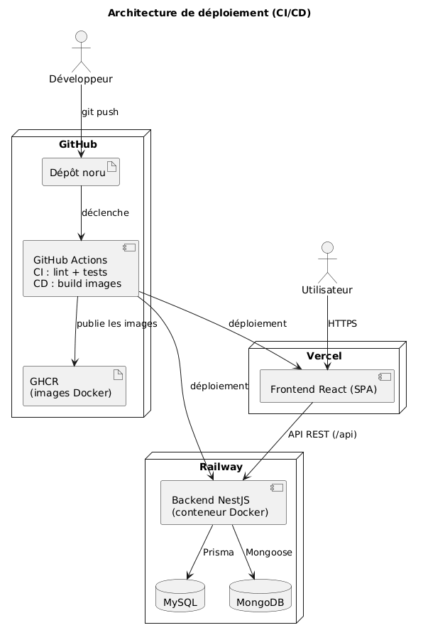
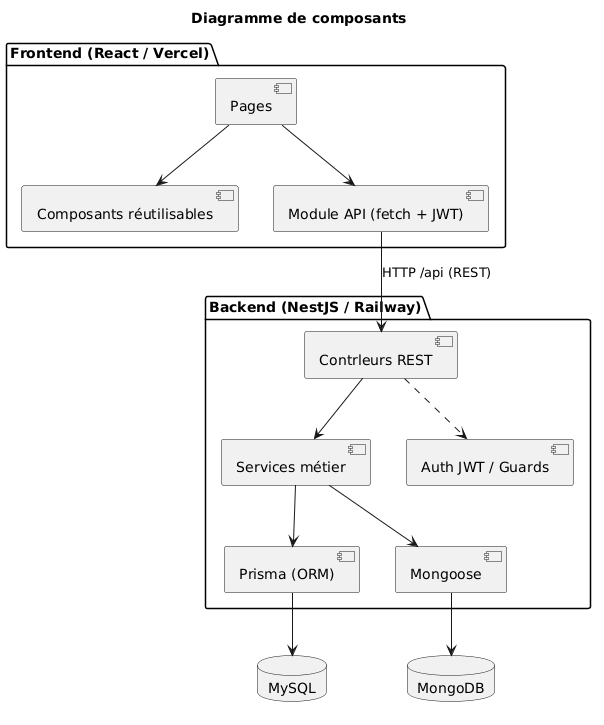
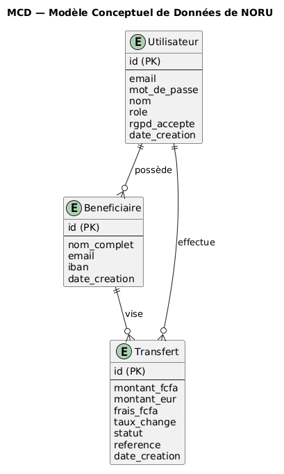

% NORU — Dossier de conception
% SEIBOU Abdou Malick — École Multimédia
% Titre Professionnel Concepteur Développeur d'Applications — 2026

```{=openxml}
<w:p><w:r><w:br w:type="page"/></w:r></w:p>
```

# Remerciements

Je tiens à exprimer ma gratitude envers l'équipe pédagogique de l'École Multimédia, dont l'accompagnement et les retours réguliers m'ont permis de structurer ma démarche et de progresser tout au long de ce projet. Les échanges avec les formateurs, jouant le rôle du client, ont été précieux pour affiner l'analyse du besoin et valider les choix de conception.

Je remercie également mes proches, qui ont servi d'utilisateurs-tests sur les maquettes et l'application, et dont les retours ont directement amélioré l'ergonomie et la clarté de l'interface.

Enfin, ce projet a été l'occasion de mettre en pratique, de bout en bout, l'ensemble des compétences du titre de Concepteur Développeur d'Applications : de l'analyse du besoin jusqu'à la mise en production, en passant par la conception, le développement et les tests.

```{=openxml}
<w:p><w:r><w:br w:type="page"/></w:r></w:p>
```

# 1. Introduction et contexte

## 1.1 Présentation générale

NORU est une application web de transfert d'argent du Bénin vers la France. Elle reproduit le fonctionnement d'un service de transfert d'argent moderne : un envoyeur crée un compte, enregistre des bénéficiaires, initie un transfert d'un montant exprimé en francs CFA (FCFA) converti en euros, le règle par mobile money, et le bénéficiaire est notifié par courrier électronique. Un espace administrateur permet de superviser l'activité, de faire évoluer le statut des opérations et de gérer les comptes.

Le nom « NORU » évoque un service simple et direct, à l'image de l'objectif du projet : rendre l'envoi d'argent aussi fluide que possible, tout en garantissant la sécurité des données et la fiabilité du service.

## 1.2 Contexte et problématique

Les transferts d'argent internationaux constituent un besoin quotidien pour de nombreuses personnes issues de la diaspora ou en relation avec elle. Au Bénin comme dans une large partie de l'Afrique de l'Ouest, l'usage du *mobile money* est très répandu et constitue souvent le principal moyen de paiement électronique. Dans le même temps, les proches installés en Europe reçoivent régulièrement de l'argent depuis leur pays d'origine, ou inversement.

Les solutions existantes présentent plusieurs limites perçues par les utilisateurs : des interfaces parfois complexes, des frais peu lisibles, et un manque de transparence sur le montant réellement reçu par le bénéficiaire. Le besoin exprimé est donc celui d'un service **simple, clair et rassurant**, dans lequel l'utilisateur comprend immédiatement combien il envoie, combien coûte l'opération, et combien le bénéficiaire va recevoir.

NORU répond à ce besoin en proposant un parcours minimaliste : quelques écrans, une conversion affichée en temps réel, un suivi clair du statut de chaque transfert.

## 1.3 Un prototype fonctionnel en attente d'autorisations

NORU est un **prototype pleinement fonctionnel** : toute la mécanique applicative d'un service de transfert est développée (comptes, bénéficiaires, conversion, cycle de vie des transferts, supervision). Le circuit de paiement est en place, mais **désactivé en attente des autorisations réglementaires** — notamment l'agrément d'établissement de monnaie électronique délivré par la BCEAO dans la zone UEMOA — **et des accords commerciaux avec les opérateurs mobile money** (MTN MoMo, Moov Money) pour l'usage de leurs API. À ce stade, **aucun flux financier réel n'est donc traité** : le paiement et le virement vers le compte bancaire du bénéficiaire ne sont pas exécutés, seule une notification est envoyée.

Ce cadrage, défini dès le cahier des charges, est un choix assumé et réaliste : lancer réellement le service supposerait aussi la conformité bancaire (KYC, lutte anti-blanchiment/LCB-FT) qui relève d'établissements agréés. Ce parti pris concentre l'effort sur les compétences visées par le titre (conception, développement, sécurité applicative, tests, déploiement), tout en gardant une architecture **prête à être branchée** dès l'obtention des autorisations. La transparence sur cet état d'avancement fait partie intégrante de la démarche.

## 1.4 Objectifs du projet

Le projet poursuit quatre objectifs principaux :

- **Simplicité** : offrir un parcours d'envoi compréhensible en quelques clics, avec une interface claire et une conversion affichée en temps réel.
- **Sécurité** : protéger les comptes et les données personnelles (authentification par jeton, mots de passe hachés, validation des entrées, conformité RGPD).
- **Fiabilité** : garantir la qualité par des tests automatisés et une chaîne d'intégration continue.
- **Mise en production réelle** : livrer une application accessible sur une URL publique, déployée de manière automatisée.

```{=openxml}
<w:p><w:r><w:br w:type="page"/></w:r></w:p>
```

# 2. Analyse de marché

## 2.1 Le marché du transfert d'argent

Le transfert d'argent international, en particulier vers l'Afrique subsaharienne, représente un marché important et en croissance, porté par les envois de fonds de la diaspora. Ce marché est caractérisé par une forte sensibilité aux frais, à la rapidité et à la simplicité d'usage, ainsi que par une adoption massive du mobile money dans les pays de destination.

## 2.2 Analyse concurrentielle

Plusieurs types d'acteurs interviennent sur ce marché :

- **Les opérateurs de mobile money et fintechs africaines** (par exemple Wave, Wari) : ils proposent des transferts rapides et à frais réduits, avec une forte pénétration locale, mais leur couverture internationale reste variable.
- **Les acteurs historiques du transfert d'argent** (Western Union, MoneyGram) : très implantés et fiables, mais souvent perçus comme coûteux et à l'interface datée.
- **Les fintechs internationales** (WorldRemit, Wise) : interfaces modernes et frais transparents, mais parfois complexes à prendre en main pour un public non technophile.

## 2.3 Positionnement de NORU

NORU ne prétend pas, à ce stade, concurrencer ces acteurs sur le plan opérationnel — c'est un prototype dont le circuit de paiement attend ses autorisations. En revanche, son positionnement conceptuel est clair : la **simplicité radicale** et la **transparence**. L'utilisateur voit immédiatement le montant envoyé, les frais, et le montant reçu en euros, sans jargon ni étape superflue. Ce positionnement guide l'ensemble des choix de conception : un nombre d'écrans réduit, une conversion affichée en direct, un suivi de statut lisible, et une interface épurée aux couleurs rassurantes.

```{=openxml}
<w:p><w:r><w:br w:type="page"/></w:r></w:p>
```

# 3. Méthode de gestion de projet

## 3.1 Démarche générale

Le projet a été mené selon une **démarche itérative**, organisée en sept phases : analyse du besoin, conception, développement, tests, déploiement, documentation et préparation à la soutenance. Ces phases ne sont pas strictement séquentielles : les tests se sont écrits en parallèle du développement, et la documentation a été alimentée tout au long du projet.

## 3.2 Recueil et priorisation des besoins

Le besoin a d'abord été recueilli et reformulé sous forme de **user stories** au format « En tant que… je veux… afin de… ». Quatorze user stories ont été rédigées, couvrant l'intégralité du périmètre fonctionnel.

Ces user stories ont ensuite été **priorisées selon la méthode MoSCoW**, qui répartit les fonctionnalités en quatre catégories : *Must have* (indispensables), *Should have* (souhaitables), *Could have* (optionnelles) et *Won't have* (hors du périmètre de cette version). Cette priorisation a permis de développer d'abord le cœur fonctionnel (authentification, bénéficiaires, transferts) avant les fonctionnalités secondaires (administration avancée, statistiques).

## 3.3 Planning (rétroplanning)

| Phase | Contenu | Durée indicative |
|---|---|---|
| 1. Analyse | User stories, cahier des charges | ~1 semaine |
| 2. Conception | Maquettes, MCD/MLD, UML, architecture | ~2 semaines |
| 3. Développement | Backend, frontend, sécurité | ~5 à 7 semaines |
| 4. Tests | Intégration, système, acceptation | en parallèle |
| 5. Déploiement | CI/CD, mise en production, rollback | ~2 semaines |
| 6. Documentation | Dossiers, journal, manuel, veille | étalée |
| 7. Soutenance | Support, démonstration, préparation orale | ~1 semaine |

## 3.4 Outils de gestion et de versionnement

Le code source a été géré avec **Git** et hébergé sur **GitHub**, selon un modèle de branches inspiré de Git Flow : une branche `main` (production, protégée), une branche `develop` (intégration), et des évolutions apportées par **Pull Requests**. La branche `main` est protégée par des règles interdisant le push direct et exigeant une intégration continue verte avant toute fusion. Les commits suivent la convention **Conventional Commits** (`feat:`, `fix:`, `docs:`, `chore:`, `test:`), ce qui rend l'historique lisible et traçable.

```{=openxml}
<w:p><w:r><w:br w:type="page"/></w:r></w:p>
```

# 4. Expression du besoin et personas

## 4.1 Personas

La conception s'est appuyée sur trois personas représentatifs des utilisateurs cibles.

**Koffi, 28 ans — l'envoyeur (rôle USER).** Koffi vit au Bénin et travaille dans le secteur privé. Il envoie régulièrement de l'argent à sa sœur, étudiante en France. Il utilise quotidiennement le mobile money et attend d'un service de transfert qu'il soit rapide, clair et sans mauvaise surprise sur les frais. Sur NORU, il crée un compte, enregistre sa sœur comme bénéficiaire (avec son IBAN), initie un transfert en saisissant un montant en FCFA, vérifie la conversion en euros, effectue le paiement, et suit l'état de son envoi.

*« Je veux envoyer de l'argent à mes proches sans me compliquer la vie, et savoir exactement ce qu'ils vont recevoir. »*

**Awa — la receveuse (sans compte).** Awa vit en France. Elle n'a pas besoin de créer de compte sur NORU : elle est simplement notifiée par email dès qu'un transfert lui est destiné. Ce choix simplifie son parcours et correspond à l'usage réel, où le bénéficiaire n'a pas nécessairement de compte sur la plateforme d'envoi.

*« Je suis prévenue par email quand de l'argent m'est envoyé. »*

**L'administrateur (rôle ADMIN).** L'administrateur supervise le fonctionnement de la plateforme. Il consulte l'ensemble des transferts, fait évoluer leur statut (par exemple de « payé » à « reçu », ce qui déclenche la notification du bénéficiaire), gère les comptes utilisateurs (création, changement de rôle, suppression) et consulte des statistiques globales.

*« Je garde une vue d'ensemble de l'activité et je gère la plateforme. »*

## 4.2 Besoins fonctionnels

De l'analyse des personas et du contexte découlent les besoins fonctionnels suivants :

1. **Créer un compte sécurisé** : inscription avec un email unique, un mot de passe robuste (au moins 8 caractères) et un consentement explicite au traitement des données (RGPD).
2. **Se connecter** : authentification donnant accès à un espace personnel sécurisé.
3. **Gérer ses bénéficiaires** : ajouter, lister et supprimer des bénéficiaires, chacun caractérisé par un nom complet, un email et un IBAN.
4. **Créer un transfert** : choisir un bénéficiaire, saisir un montant en FCFA, et visualiser en temps réel la conversion en euros ainsi que les frais.
5. **Payer et suivre** : régler le transfert par mobile money, puis suivre l'évolution de son statut.
6. **Notifier le bénéficiaire** : envoyer une notification par email lorsque le transfert est reçu.
7. **Superviser (administrateur)** : accéder à l'ensemble des transferts et des utilisateurs, faire évoluer les statuts, gérer les comptes et consulter des statistiques.

## 4.3 Besoins non fonctionnels

- **Sécurité** : mots de passe hachés, authentification par jeton, validation systématique des entrées, protection contre les failles courantes.
- **Ergonomie et accessibilité** : interface claire, responsive (mobile, tablette, ordinateur), respect des règles d'accessibilité.
- **Performance** : temps de réponse rapides, requêtes optimisées.
- **Maintenabilité** : code organisé en couches, testé et documenté.
- **Conformité** : respect du RGPD pour les données personnelles.

```{=openxml}
<w:p><w:r><w:br w:type="page"/></w:r></w:p>
```

# 5. Cahier des charges

## 5.1 Périmètre fonctionnel

Le périmètre fonctionnel se décompose en cinq grands ensembles :

- **F1 — Authentification et compte** : inscription, connexion (par jeton JWT), suppression de compte au titre du droit à l'effacement.
- **F2 — Bénéficiaires** : création, consultation et suppression des bénéficiaires propres à chaque utilisateur.
- **F3 — Transferts** : création d'un transfert avec conversion FCFA→EUR et calcul des frais, paiement par mobile money, consultation de la liste et du détail, suivi du statut.
- **F4 — Notification** : envoi d'une notification par email au bénéficiaire.
- **F5 — Administration** : supervision de l'ensemble des transferts et des utilisateurs, changement de statut, opérations de création, de changement de rôle et de suppression sur les utilisateurs et les transferts, statistiques.

## 5.2 User stories détaillées

| ID | En tant que… | je veux… | afin de… | Priorité |
|---|---|---|---|---|
| US-01 | visiteur | créer un compte (email, mot de passe) | accéder à NORU | Haute |
| US-02 | utilisateur | me connecter | accéder à mon espace sécurisé | Haute |
| US-03 | envoyeur | enregistrer un bénéficiaire (nom, email, IBAN) | ne pas ressaisir ses informations | Haute |
| US-04 | envoyeur | voir / modifier / supprimer mes bénéficiaires | garder ma liste à jour | Moyenne |
| US-05 | envoyeur | créer un transfert (bénéficiaire + montant FCFA) | envoyer de l'argent | Haute |
| US-06 | envoyeur | voir le montant en euros et les frais avant de valider | savoir ce que le bénéficiaire recevra | Haute |
| US-07 | envoyeur | régler mon transfert par mobile money | financer mon transfert | Haute |
| US-08 | envoyeur | consulter la liste de mes transferts et leurs statuts | suivre mes envois | Haute |
| US-09 | envoyeur | voir le détail d'un transfert | vérifier les informations | Moyenne |
| US-10 | bénéficiaire | recevoir un email de notification | être prévenu qu'un transfert arrive | Haute |
| US-11 | utilisateur | supprimer mon compte et mes données | exercer mon droit à l'effacement | Moyenne |
| US-12 | admin | consulter tous les transferts et utilisateurs | superviser l'activité | Haute |
| US-13 | admin | changer le statut d'un transfert | gérer le cycle de vie | Haute |
| US-14 | admin | consulter des statistiques | avoir une vue d'ensemble | Moyenne |

Chaque user story donne lieu à des **critères d'acceptation** vérifiables. Par exemple, pour US-05 : le montant doit être supérieur à un seuil minimal, le bénéficiaire doit appartenir à l'utilisateur connecté, et le transfert créé doit apparaître au statut initial « en attente » avec une référence unique.

## 5.3 Contraintes techniques

- **Stack imposée** : React (frontend), NestJS (backend, API REST), MySQL (relationnel) et MongoDB (NoSQL), le tout conteneurisé avec Docker.
- **Responsive** : l'application doit être utilisable sur mobile (375 px), tablette (768 px) et ordinateur (1280 px).
- **Sécurité** : mots de passe hachés, jeton JWT, validation des entrées, aucun secret dans le dépôt.
- **Déploiement** : mise en ligne sur une URL publique via une chaîne d'intégration et de déploiement continus.

## 5.4 Hors-périmètre

Sont hors du périmètre de cette version — et constituent les étapes d'un lancement réel : le paiement réel via les API des opérateurs (MTN MoMo, Moov) et le virement bancaire vers l'IBAN, tous deux subordonnés à l'**agrément d'établissement de paiement (BCEAO / UEMOA)** et à la conformité **KYC / LCB-FT** ; l'application mobile native (le web responsive en tient lieu) ; le multi-devises (seul le couple FCFA→EUR est géré) ; et un compte dédié pour le bénéficiaire (qui reçoit seulement un email).

## 5.5 Livrables

Les livrables du projet comprennent : le code source versionné sur GitHub, l'application déployée sur une URL publique, le présent dossier de conception, le cahier des charges, le plan de tests, le journal de développement, le manuel d'utilisation, la fiche de veille, le Dossier Professionnel et le support de soutenance.

```{=openxml}
<w:p><w:r><w:br w:type="page"/></w:r></w:p>
```

# 6. Conception de l'interface (UX / UI)

## 6.1 Démarche de conception

La conception des interfaces a suivi une démarche en deux temps. Dans un premier temps, des **wireframes basse fidélité** ont permis de définir la structure des écrans et le parcours utilisateur, sans se préoccuper de l'esthétique : disposition des zones, enchaînement des écrans, emplacement des actions principales. Dans un second temps, des **maquettes haute fidélité** ont décliné ces wireframes en intégrant la charte graphique, les couleurs, la typographie et les composants finalisés.

Cette démarche progressive présente l'avantage de valider l'ergonomie et la navigation avant d'investir dans le détail visuel, et de recueillir des retours d'utilisateurs-tests à chaque étape.

## 6.2 Parcours utilisateur

Le parcours principal de l'envoyeur est le suivant : inscription ou connexion → tableau de bord listant ses transferts → ajout d'un bénéficiaire → création d'un transfert (choix du bénéficiaire, saisie du montant, visualisation de la conversion) → paiement par mobile money → suivi du statut. L'espace administrateur ajoute un parcours de supervision : consultation de tous les transferts, changement de statut, gestion des utilisateurs.

## 6.3 Charte graphique

La charte graphique a été pensée pour évoquer la **confiance** et la **simplicité**, valeurs essentielles pour un service financier.

- **Palette de couleurs** : une dominante de vert émeraude (couleur associée à la fiabilité et à l'argent), déclinée en plusieurs tons, complétée par des neutres (blancs, gris) pour le fond et le texte, et par des couleurs sémantiques pour les statuts (gris pour « en attente », bleu pour « payé », ambre pour « envoyé », vert pour « reçu », rouge pour « échec »).
- **Typographie** : une police sans-serif système, lisible et moderne, avec une hiérarchie claire entre les titres (poids fort) et le corps de texte.
- **Composants réutilisables** : boutons, champs de saisie, cartes, badges de statut, barre de navigation — chacun décliné dans ses différents états (normal, survol, désactivé, erreur).

## 6.4 Accessibilité

Les règles d'accessibilité issues du référentiel RGAA ont été prises en compte : utilisation d'éléments HTML sémantiques, association explicite des libellés aux champs de formulaire, contrastes suffisants entre le texte et le fond, navigation possible au clavier, et gestion visible du focus.

## 6.5 Responsive et approche mobile-first

L'interface a été développée en approche **mobile-first** : les styles par défaut ciblent le mobile, et des adaptations sont ajoutées pour les écrans plus larges. L'application a été testée sur trois tailles de référence : mobile (375 px), tablette (768 px) et ordinateur (1280 px). Ce choix est cohérent avec l'usage réel du service, majoritairement mobile.

```{=openxml}
<w:p><w:r><w:br w:type="page"/></w:r></w:p>
```

# 7. Formalisation UML

La modélisation UML a permis de formaliser la structure et le comportement de l'application avant et pendant le développement. Sept diagrammes ont été produits, chacun répondant à un objectif précis. Les sources sont versionnées au format PlantUML dans le dépôt.

## 7.1 Diagramme de cas d'utilisation



Ce diagramme répond à la question « qui peut faire quoi ? ». Il fait apparaître trois acteurs : le **Visiteur** (non connecté), l'**Envoyeur** (utilisateur connecté) et l'**Administrateur**. Le bénéficiaire n'est pas un acteur du système — il ne s'y connecte pas —, il est seulement notifié par email. L'Envoyeur est un Visiteur qui s'est connecté : il hérite donc du cas d'usage « se connecter ». Deux relations d'inclusion sont notables : « créer un transfert » inclut « payer par mobile money » (on ne crée pas un transfert sans le financer), et « changer le statut » inclut « notifier le bénéficiaire » (le passage au statut « reçu » déclenche l'email).

## 7.2 Diagramme d'états-transitions



Ce diagramme modélise le **cycle de vie d'un transfert**, qui est le cœur métier de l'application. Un transfert naît au statut `EN_ATTENTE`, passe à `PAYE` après le paiement par mobile money, puis à `ENVOYE` lors du traitement, et enfin à `RECU` lorsque l'administrateur marque la réception (ce qui notifie le bénéficiaire). Une branche `ECHEC` gère les cas d'erreur (paiement refusé, incident de traitement). Ce diagramme se traduit directement dans le code par le champ `statut` de la table `transfert`, typé en `ENUM`, et par les règles qui encadrent les transitions (par exemple, un transfert déjà payé ne peut pas être payé de nouveau).

## 7.3 Diagramme de classes



Ce diagramme représente la structure du code backend, organisée en trois couches. Les **entités** (`Utilisateur`, `Beneficiaire`, `Transfert`), correspondant aux modèles de données, avec leurs attributs et leurs relations. Les **services** (`AuthService`, `BeneficiairesService`, `TransfertsService`, `AdminService`, `NotificationsService`, `PrismaService`), qui portent la logique métier. Les **contrôleurs** (`AuthController`, `BeneficiairesController`, `TransfertsController`, `AdminController`), qui exposent l'API REST. Le sens des dépendances est clair : un contrôleur dépend d'un service, qui dépend du service d'accès aux données (Prisma), qui accède à la base. Cette séparation en couches est la traduction directe de l'architecture.

## 7.4 Diagrammes de séquence

Deux diagrammes de séquence détaillent les parcours critiques.

**Connexion et génération du jeton JWT :**



L'utilisateur saisit ses identifiants ; le frontend envoie une requête au contrôleur d'authentification ; le service recherche l'utilisateur en base, vérifie le mot de passe avec bcrypt, puis génère un jeton JWT signé ; le jeton est renvoyé au frontend, qui le stocke et l'utilise pour les requêtes suivantes.

**Création d'un transfert :**



La requête traverse le garde d'authentification (vérification du jeton), le contrôleur, puis le service, qui vérifie l'appartenance du bénéficiaire, calcule les frais et la conversion, génère une référence, et enregistre le transfert au statut initial.

## 7.5 Diagramme d'activité



Ce diagramme représente le processus d'inscription sous forme d'enchaînement d'étapes avec ses **branches de décision** : validation des données saisies, vérification du consentement RGPD (obligatoire), contrôle de l'unicité de l'email, puis hachage du mot de passe, création de l'utilisateur et connexion. Il met en évidence les chemins alternatifs (erreurs) et pas seulement le chemin nominal.

## 7.6 Diagramme de déploiement



Ce diagramme décrit l'infrastructure : le développeur pousse son code sur GitHub, où GitHub Actions exécute l'intégration continue puis publie les images Docker sur le registre GHCR ; le backend et les bases de données sont hébergés sur Railway, le frontend sur Vercel ; l'utilisateur accède au frontend, qui appelle l'API du backend.

## 7.7 Diagramme de composants



Ce diagramme détaille les briques logicielles et leurs dépendances : côté frontend (pages, composants réutilisables, module d'appel API), côté backend (contrôleurs REST → services métier → Prisma et Mongoose), reliés aux bases MySQL et MongoDB.

```{=openxml}
<w:p><w:r><w:br w:type="page"/></w:r></w:p>
```

# 8. Conception de la base de données

## 8.1 Modèle Conceptuel de Données (MCD)



Le MCD, exprimé en formalisme entité-association, fait apparaître trois entités principales et leurs cardinalités :

- un **Utilisateur** possède de 0 à plusieurs **Bénéficiaires** ; un Bénéficiaire appartient à exactement un Utilisateur ;
- un **Utilisateur** effectue de 0 à plusieurs **Transferts** ; un Transfert est effectué par exactement un Utilisateur ;
- un **Bénéficiaire** est visé par de 0 à plusieurs **Transferts** ; un Transfert vise exactement un Bénéficiaire.

## 8.2 Modèle Logique de Données (MLD)

Le passage au MLD traduit chaque entité en table et chaque association en clé étrangère, en précisant les types et les contraintes.

**Table `utilisateur`**

| Colonne | Type | Contraintes | Rôle |
|---|---|---|---|
| id | INT | PK, AUTO_INCREMENT | Identifiant unique |
| email | VARCHAR(180) | NOT NULL, UNIQUE | Identifiant de connexion |
| mot_de_passe | VARCHAR(255) | NOT NULL | Empreinte bcrypt du mot de passe |
| nom | VARCHAR(100) | NOT NULL | Nom de l'utilisateur |
| role | ENUM('USER','ADMIN') | défaut 'USER' | Rôle et droits |
| rgpd_accepte | BOOLEAN | défaut false | Consentement RGPD |
| date_creation | DATETIME | défaut now() | Date d'inscription |

**Table `beneficiaire`**

| Colonne | Type | Contraintes | Rôle |
|---|---|---|---|
| id | INT | PK, AUTO_INCREMENT | Identifiant unique |
| nom_complet | VARCHAR(150) | NOT NULL | Nom du bénéficiaire |
| email | VARCHAR(180) | NOT NULL | Email de notification |
| iban | VARCHAR(34) | NOT NULL | Coordonnées bancaires |
| utilisateur_id | INT | FK → utilisateur(id), ON DELETE CASCADE | Propriétaire |
| date_creation | DATETIME | défaut now() | Date d'ajout |

**Table `transfert`**

| Colonne | Type | Contraintes | Rôle |
|---|---|---|---|
| id | INT | PK, AUTO_INCREMENT | Identifiant unique |
| montant_fcfa | DECIMAL(12,2) | NOT NULL, CHECK > 0 | Montant envoyé en FCFA |
| montant_eur | DECIMAL(12,2) | NOT NULL | Montant reçu en euros |
| frais_fcfa | DECIMAL(12,2) | défaut 0 | Frais de service |
| taux_change | DECIMAL(10,6) | NOT NULL | Taux appliqué |
| statut | ENUM(5 valeurs) | défaut 'EN_ATTENTE' | Statut du transfert |
| reference | VARCHAR(30) | NOT NULL, UNIQUE | Référence unique |
| utilisateur_id | INT | FK → utilisateur(id) | Envoyeur |
| beneficiaire_id | INT | FK → beneficiaire(id) | Destinataire |
| date_creation | DATETIME | défaut now() | Date de création |

## 8.3 Justification des choix

- **DECIMAL et non FLOAT** pour les montants : le type flottant introduit des erreurs d'arrondi inacceptables sur de la monnaie ; le type DECIMAL garantit une précision exacte.
- **ENUM** pour `role` et `statut` : contraint les valeurs valides directement au niveau de la base de données, empêchant toute valeur incohérente.
- **Stockage du taux de change** dans le transfert : le taux évolue dans le temps ; le conserver au moment de l'opération assure la traçabilité et la reproductibilité du calcul.
- **UNIQUE** sur `email` et `reference` : empêche les doublons (un email par compte, une référence par transfert).
- **ON DELETE CASCADE** sur les bénéficiaires : lorsqu'un utilisateur supprime son compte (droit à l'effacement RGPD), ses bénéficiaires sont supprimés avec lui.

## 8.4 Intégrité, contraintes et optimisation

L'intégrité référentielle est assurée par les clés étrangères. Les contraintes `NOT NULL` garantissent la présence des informations essentielles, et la contrainte `CHECK` sur le montant empêche les valeurs négatives ou nulles. Les colonnes servant de clés primaires et étrangères sont indexées, ce qui optimise les jointures et les recherches fréquentes.

## 8.5 Mise en place avec Prisma et migrations

La base de données relationnelle est mise en place via l'ORM **Prisma**. Le schéma Prisma décrit les modèles et leurs relations, et Prisma génère un client typé pour interroger la base. Les évolutions du schéma passent par des **migrations versionnées**, ce qui permet de suivre l'historique des changements et de les appliquer de manière reproductible sur chaque environnement, y compris en production au démarrage du conteneur.

## 8.6 Modèle Physique de Données (MPD)

Le MPD correspond à l'implémentation effective dans le système de gestion de base de données. Pour NORU, il s'agit de la base **MySQL 8** générée à partir du schéma Prisma (tables, colonnes, types, index, contraintes), complétée par la base **MongoDB** pour le journal des notifications.

## 8.7 Base NoSQL (MongoDB)

Une collection `notifications` en MongoDB enregistre le journal des notifications envoyées aux bénéficiaires : type, destinataire, sujet, contenu, référence du transfert, statut d'envoi et date. Ce choix d'une base NoSQL se justifie par la nature de ces données : volumineuses, à format souple et non relationnelles. Les données financières structurées, en revanche, restent en base relationnelle, où l'intégrité et les relations sont essentielles. Cette combinaison illustre l'usage complémentaire du SQL et du NoSQL.

```{=openxml}
<w:p><w:r><w:br w:type="page"/></w:r></w:p>
```

# 9. Architecture logicielle

## 9.1 Vue d'ensemble

NORU repose sur une **architecture client-serveur découplée**, organisée en couches :

- **Couche de présentation** : une application React de type single-page application (SPA), hébergée sur Vercel, qui affiche les interfaces et consomme l'API.
- **Couche applicative et métier** : une API REST développée avec NestJS, hébergée sur Railway, organisée en interne en contrôleurs (routes HTTP), services (logique métier) et accès aux données.
- **Couche d'accès aux données** : l'ORM Prisma pour la base relationnelle MySQL, et Mongoose pour la base NoSQL MongoDB.

Le frontend et le backend sont hébergés séparément et communiquent via l'API REST, de manière **sans état** : l'authentification repose sur un jeton JWT transmis à chaque requête, sans session côté serveur.

## 9.2 Communication et API REST

L'API suit les conventions REST : les ressources sont exposées par des routes claires (`/api/transferts`, `/api/beneficiaires`, `/api/admin/...`), les verbes HTTP correspondent aux opérations (GET pour lire, POST pour créer, PATCH pour modifier, DELETE pour supprimer), et les codes de réponse sont normalisés (200/201 pour un succès, 400 pour une erreur de validation, 401 pour un défaut d'authentification, 403 pour un accès interdit, 404 pour une ressource introuvable).

## 9.3 Patrons de conception mis en œuvre

- **Injection de dépendances** : NestJS injecte les services dans les contrôleurs, ce qui découple les composants et facilite les tests.
- **DTO (Data Transfer Object)** : les données entrantes sont décrites par des objets de transfert validés, garantissant que seules des données conformes atteignent la logique métier.
- **Guards** : des gardes interceptent les requêtes pour vérifier l'authentification (JWT) et l'autorisation (rôle), avant d'atteindre le contrôleur.
- **Séparation des responsabilités** : chaque couche a un rôle unique, ce qui rend le code maintenable.

## 9.4 Justification des choix techniques

Chaque choix a été fait en pesant ses avantages, l'écosystème et la cohérence de l'ensemble.

- **React** a été retenu pour le frontend car c'est un standard du marché, doté d'un large écosystème et d'un modèle par composants réutilisables. Les alternatives (Vue, Angular) étaient envisageables, mais React offre la plus grande adoption et la meilleure disponibilité de ressources.
- **NestJS** a été retenu pour le backend car il impose une architecture en couches claire et repose sur TypeScript, ce qui permet d'avoir **un seul langage sur toute la stack**. Par rapport à un framework PHP comme Symfony, ce choix simplifie la maintenance et capitalise sur un langage unique.
- **MySQL** a été retenu pour les données structurées et fortement reliées (relations entre utilisateur, bénéficiaire et transfert), avec **Prisma** comme ORM type-safe, qui protège nativement contre l'injection SQL et gère les migrations.
- **MongoDB** a été retenu pour le journal des notifications, un cas d'usage typique du NoSQL.
- **Docker** assure un environnement identique en développement et en production.
- **Railway et Vercel** ont été retenus pour un déploiement automatisé et simple depuis GitHub.

```{=openxml}
<w:p><w:r><w:br w:type="page"/></w:r></w:p>
```

# 10. Technologies utilisées

Cette section présente brièvement chaque technologie mobilisée et sa contribution au projet.

**React** est une bibliothèque JavaScript de construction d'interfaces utilisateur, fondée sur des composants réutilisables. Elle permet de construire une single-page application réactive et modulaire.

**TypeScript** est un sur-ensemble typé de JavaScript. Il apporte la vérification de types à la compilation, ce qui réduit les erreurs et améliore la maintenabilité. Il est utilisé côté frontend et côté backend.

**Vite** est l'outil de build et de serveur de développement du frontend. Il offre un rechargement à chaud rapide et une compilation optimisée pour la production.

**Tailwind CSS** est un framework CSS utilitaire qui permet de styliser l'interface directement dans le balisage, de manière cohérente et rapide, tout en facilitant le responsive.

**NestJS** est un framework Node.js pour construire des applications serveur en TypeScript. Il structure l'application en modules, contrôleurs et services, et fournit nativement l'injection de dépendances, la validation et les gardes.

**Prisma** est un ORM moderne qui génère un client typé à partir d'un schéma, gère les migrations et protège contre l'injection SQL grâce aux requêtes paramétrées.

**MySQL** est un système de gestion de base de données relationnelle, utilisé pour stocker les données structurées (utilisateurs, bénéficiaires, transferts).

**MongoDB** est une base de données NoSQL orientée documents, utilisée pour le journal des notifications, avec **Mongoose** comme bibliothèque de modélisation.

**JWT (JSON Web Token)** est un standard de jeton d'authentification signé, utilisé pour sécuriser l'API sans état. **bcrypt** est l'algorithme de hachage des mots de passe.

**Docker** est un outil de conteneurisation qui permet d'exécuter l'application et ses bases dans des environnements isolés et reproductibles.

**GitHub Actions** est le service d'intégration et de déploiement continus, qui exécute automatiquement le lint, les tests et la construction des images.

**GHCR (GitHub Container Registry)** stocke les images Docker produites.

**Railway** héberge le backend et les bases de données ; **Vercel** héberge le frontend.

```{=openxml}
<w:p><w:r><w:br w:type="page"/></w:r></w:p>
```

# 11. Développement

## 11.1 Backend (NestJS)

Le backend est organisé en modules, chacun regroupant un contrôleur, un service et ses objets de transfert. Le module **Auth** gère l'inscription (avec hachage bcrypt du mot de passe), la connexion (avec génération d'un jeton JWT) et la suppression de compte (droit à l'effacement). Le module **Beneficiaires** gère les opérations CRUD sur les bénéficiaires, avec un contrôle strict d'appartenance : un utilisateur n'accède qu'à ses propres bénéficiaires. Le module **Transferts** porte la logique métier : à la création, il vérifie l'appartenance du bénéficiaire, calcule les frais (2 % du montant) et la conversion FCFA→EUR (au taux fixe de 655,957), génère une référence unique, et enregistre le transfert au statut initial ; il gère aussi le paiement par mobile money et le passage de statut. Le module **Admin** offre la supervision et les opérations CRUD sur les utilisateurs et les transferts, protégées par un rôle administrateur. Le module **Notifications** enregistre les notifications dans MongoDB et prépare l'email (dont l'envoi réel est prévu en évolution).

## 11.2 Frontend (React)

Le frontend est organisé par pages (connexion, inscription, tableau de bord, bénéficiaires, nouvel envoi, espace administrateur) et par composants réutilisables (mise en page, badge de statut, route protégée). L'état de session (le jeton JWT) est géré par un contexte React. Les appels à l'API sont centralisés dans un module unique qui ajoute automatiquement le jeton et remonte les erreurs sous forme de messages lisibles. L'interface gère les états de chargement et d'erreur sur chaque appel, et est développée en approche mobile-first avec Tailwind CSS.

```{=openxml}
<w:p><w:r><w:br w:type="page"/></w:r></w:p>
```

# 12. Sécurité de l'application

La sécurité a été traitée en s'appuyant sur les recommandations de l'OWASP.

- **Contrôle d'accès (Broken Access Control)** : l'accès aux ressources est protégé par le jeton JWT, l'autorisation par rôle (`@Roles('ADMIN')`) pour l'espace administrateur, et un contrôle d'appartenance systématique — chaque utilisateur n'accède qu'à ses propres bénéficiaires et transferts. Un administrateur ne peut pas supprimer son propre compte.
- **Défaillances cryptographiques** : les mots de passe sont hachés avec bcrypt et ne sont jamais stockés en clair ; les secrets (clé de signature JWT, mots de passe de base) sont placés dans des variables d'environnement, jamais versionnées.
- **Injection** : l'accès aux données passe par l'ORM Prisma, qui utilise des requêtes paramétrées ; aucune chaîne utilisateur n'est concaténée dans une requête. Les entrées sont validées systématiquement par des DTO.
- **Mauvaise configuration** : la politique CORS restreint les origines autorisées ; les fichiers d'environnement sont exclus du dépôt.
- **Défauts d'authentification** : le jeton JWT est signé côté serveur ; les messages d'erreur de connexion sont volontairement neutres, pour ne pas révéler si c'est l'email ou le mot de passe qui est en cause.
- **XSS** : le rendu par défaut de React échappe automatiquement les contenus affichés.
- **Scan des dépendances** : les dépendances sont analysées à la recherche de vulnérabilités connues.

```{=openxml}
<w:p><w:r><w:br w:type="page"/></w:r></w:p>
```

# 13. Tests et qualité

## 13.1 Stratégie de test

La stratégie de test s'organise en **trois niveaux**.

- **Tests d'intégration** : automatisés avec Jest et Supertest, ils lancent la véritable application et vérifient les parcours de l'API de bout en bout — inscription, validation des entrées (cas d'erreur), connexion, protection des routes, création de bénéficiaire, création de transfert avec vérification de la conversion, paiement, et contrôle d'accès à l'espace administrateur. Ils couvrent les cas nominaux (200, 201) et les cas d'erreur (400, 401, 403).
- **Tests système** : des scénarios manuels de bout en bout exécutés sur l'application déployée (inscription, connexion, création et paiement d'un transfert, suivi des statuts).
- **Tests d'acceptation** : formulés au format Given-When-Then à partir des user stories, ils vérifient que ce qui a été demandé est effectivement livré, en langage métier.

## 13.2 Qualité du code

La qualité du code est assurée par une analyse statique (ESLint) et par TypeScript en mode strict, exécutées automatiquement dans la chaîne d'intégration continue. Le style est uniformisé. Ces contrôles bloquent la fusion en cas d'échec, garantissant qu'aucun code non conforme n'atteint la production.

```{=openxml}
<w:p><w:r><w:br w:type="page"/></w:r></w:p>
```

# 14. Déploiement et démarche DevOps

## 14.1 Environnements

Trois environnements sont distingués : le **développement** (machine locale, bases en conteneurs Docker), le **test** (runner d'intégration continue, avec bases en services), et la **production** (backend et bases sur Railway, frontend sur Vercel).

## 14.2 Intégration continue (CI)

À chaque push et chaque Pull Request, un workflow GitHub Actions démarre MySQL et MongoDB en services, applique les migrations, exécute l'analyse de code (lint) et les tests automatisés, côté backend et côté frontend (lint et build). La branche `main` est protégée : la fusion n'est possible que si l'intégration continue est verte.

## 14.3 Déploiement continu (CD)

À chaque arrivée de code sur `main`, un workflow construit les images Docker du backend et du frontend et les publie sur le registre GHCR, en les taguant avec l'identifiant unique du commit (SHA). Le déploiement effectif est assuré par Railway (backend et bases) et Vercel (frontend), qui redéploient automatiquement depuis GitHub. Les migrations Prisma s'appliquent au démarrage du conteneur backend.

## 14.4 Procédure de déploiement

Le travail est développé sur une branche, fusionné dans `develop`, puis une Pull Request `develop → main` est ouverte ; l'intégration continue doit être verte. Après fusion, Railway et Vercel redéploient automatiquement, et l'application est à jour sur son URL publique.

## 14.5 Procédure de rollback

En cas de bug critique, le retour arrière s'effectue en sélectionnant le dernier déploiement stable sur Railway et en le redéployant, et en promouvant un déploiement antérieur sur Vercel. Comme chaque image Docker est taguée par le SHA du commit, une version précise peut être redéployée. D'autres stratégies existent (déploiement bleu-vert, canari, rolling update).

## 14.6 Incidents rencontrés et résolutions

La mise en production a donné lieu à plusieurs incidents, résolus en suivant une démarche **détection – diagnostic – correction** :

- **Erreur 502 (port)** : le domaine public routait vers un port différent de celui écouté par l'application ; corrigé par la définition d'une variable d'environnement `PORT`.
- **Plantage de connexion MongoDB** : l'adresse de connexion n'était pas valide ; corrigé en renseignant l'URI complète.
- **Erreur 404 au rafraîchissement** : le routage d'une single-page application n'était pas géré côté hébergeur ; corrigé par un fichier de réécriture renvoyant les routes vers le point d'entrée.

```{=openxml}
<w:p><w:r><w:br w:type="page"/></w:r></w:p>
```

# 15. Conformité réglementaire

## 15.1 RGPD

Le traitement des données personnelles respecte les principes du RGPD : **consentement** explicite obligatoire à l'inscription, **droit à l'effacement** (suppression du compte et de toutes ses données), **minimisation** (seules les données nécessaires sont collectées), et **sécurité** (mots de passe hachés, secrets hors du dépôt).

Concernant la notification par email, le système enregistre chaque notification dans la base et prépare le message ; l'**envoi réel via un service SMTP constitue une évolution prévue** — dans la version actuelle, cet envoi n'est pas encore branché, ce qui est cohérent avec l'état de prototype du projet.

## 15.2 Accessibilité (RGAA)

Les règles d'accessibilité prises en compte incluent l'usage d'éléments HTML sémantiques, l'association des libellés aux champs, des contrastes suffisants, la navigation au clavier et la gestion du focus, ainsi que le responsive mobile-first.

```{=openxml}
<w:p><w:r><w:br w:type="page"/></w:r></w:p>
```

# 16. Évolutions futures

Plusieurs évolutions sont envisagées pour prolonger le projet :

**À court terme** : l'envoi réel des emails de notification via un service SMTP ; l'historique et les filtres avancés des transferts ; l'export en PDF d'un reçu de transfert.

**À moyen terme** : l'intégration d'un vrai paiement via une passerelle mobile money ; des notifications en temps réel ; et une application mobile native (par exemple avec React Native), pour prolonger l'expérience au-delà du web responsive.

Ces évolutions sont priorisées selon leur valeur ajoutée pour l'utilisateur et leur complexité technique.

```{=openxml}
<w:p><w:r><w:br w:type="page"/></w:r></w:p>
```

# 17. Conclusion

NORU a permis de concevoir et de développer, de bout en bout, une application web sécurisée et déployée en production, couvrant l'ensemble des compétences du titre de Concepteur Développeur d'Applications : l'analyse du besoin et le maquettage, la conception de l'architecture et de la base de données, le développement des interfaces et des composants métier, la sécurisation, les tests, et la mise en production dans une démarche DevOps.

Au-delà du résultat technique — une application fonctionnelle, testée, versionnée et accessible en ligne —, ce projet a été l'occasion d'adopter une **démarche professionnelle** : cadrage explicite du besoin et du hors-périmètre, priorisation, gestion de version rigoureuse, automatisation de la qualité, et résolution structurée des incidents. Il constitue une base solide, extensible vers un service réel.

```{=openxml}
<w:p><w:r><w:br w:type="page"/></w:r></w:p>
```

# 18. Annexes

- **Sources des diagrammes** (PlantUML) : dossier `docs/diagrams/` du dépôt.
- **Liste complète des user stories** : `docs/01-user-stories.md`.
- **Cahier des charges détaillé** : `docs/02-cahier-des-charges.md`.
- **Modèle de données** : `docs/03-modele-de-donnees.md`.
- **Documentation de déploiement** : `docs/06-deploiement.md`.
- **Code source** : https://github.com/ABDULMVLICK/noru
- **Application en ligne** : https://noru-two.vercel.app
